# Arquitectura — FindJob IA

Buscador de trabajo remoto para LatAm/Colombia. Agrega ofertas de varias
plataformas, las deduplica, las rankea semánticamente contra tu CV y las sirve en
una web con login por usuario. Todo corre en Docker.

## Stack

| Capa | Tecnología |
|---|---|
| Web | Django 5 (auth, ORM, templates) |
| Base de datos | PostgreSQL 16 |
| Scraping | JobSpy (LinkedIn/Indeed) + conectores API |
| Ranking | Embeddings locales E5 multilingüe (sentence-transformers) o keywords |
| CV | pypdf (extracción de texto) |
| Orquestación | Docker Compose (`db` + `web`) |

---

## Diagrama de componentes

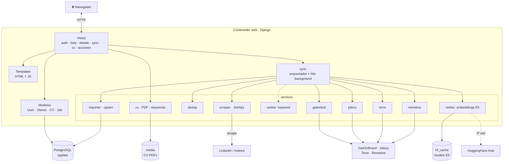

---

## Modelo de datos

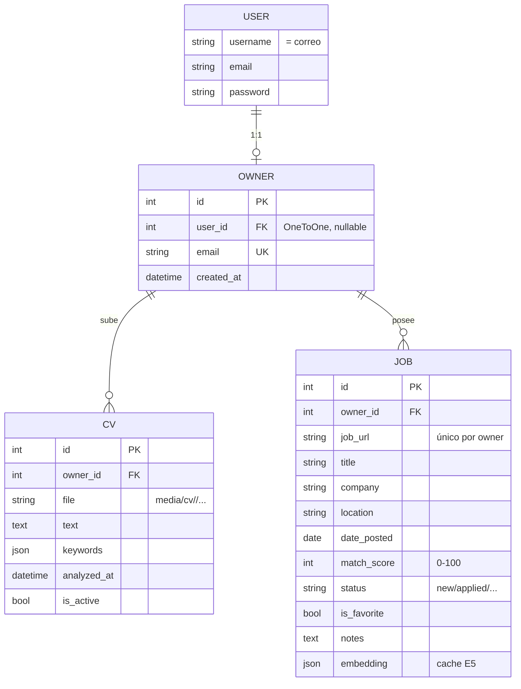

---

## Flujos por acción

### 1. Registro

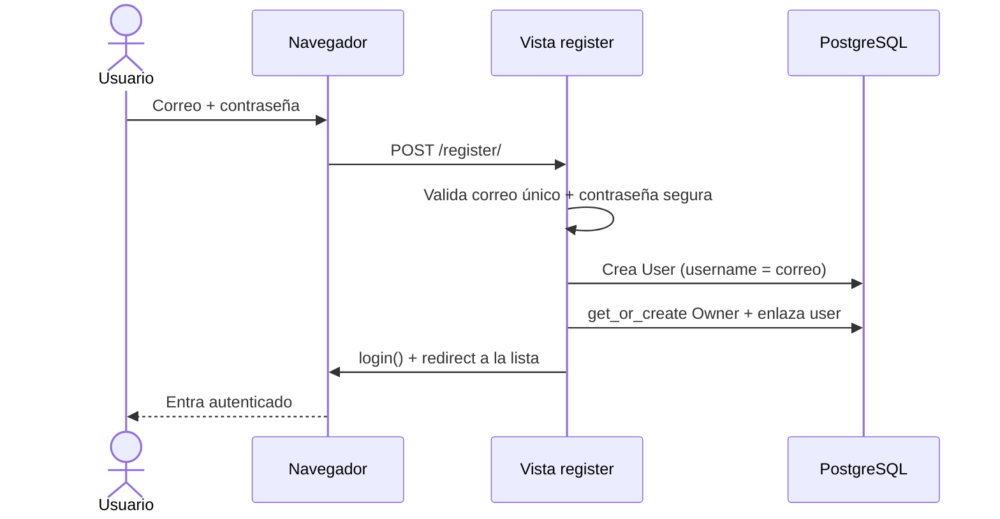

### 2. Login

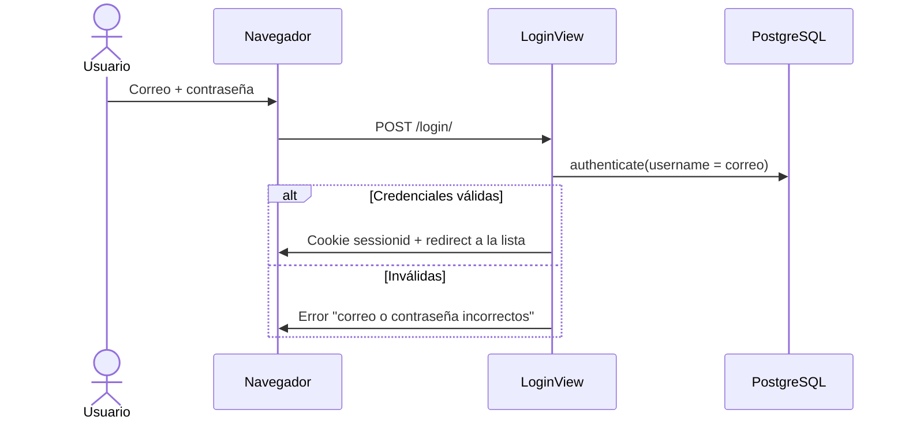

### 3. Logout

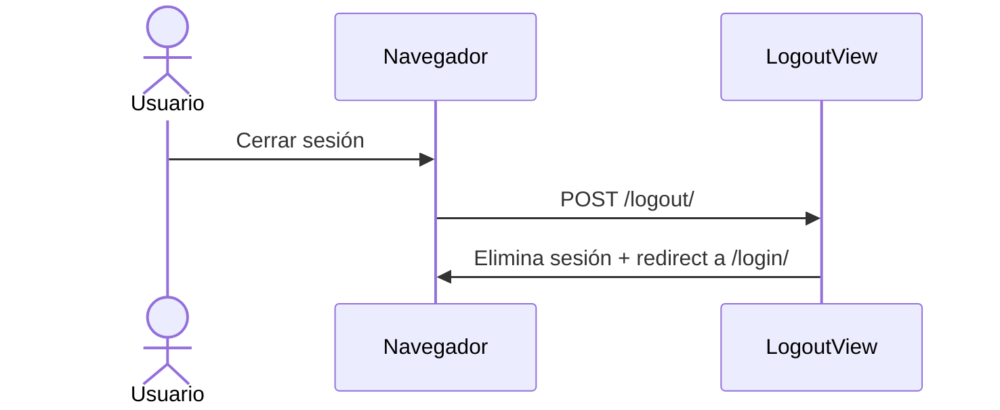

### 4. Subir CV

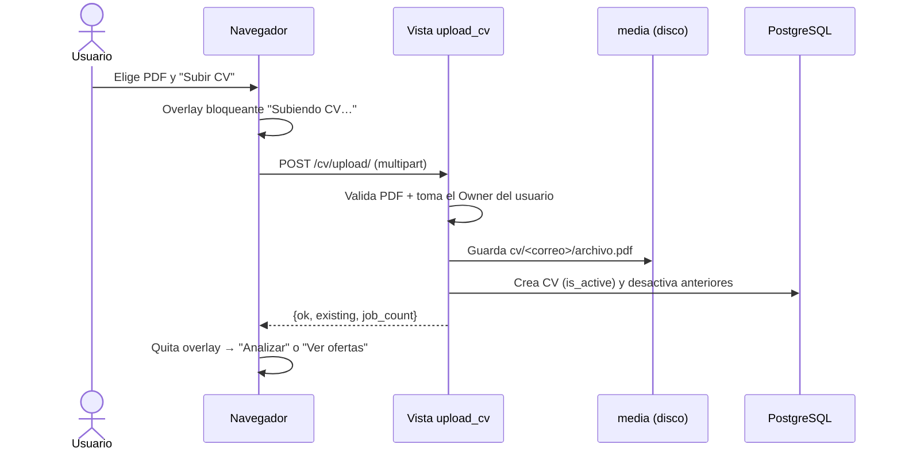

### 5. Analizar CV

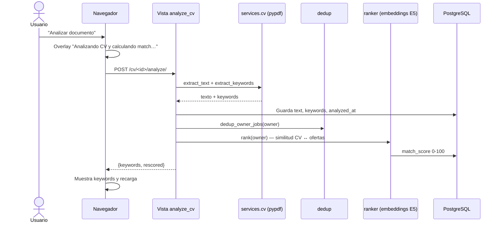

### 6. Sincronizar ofertas

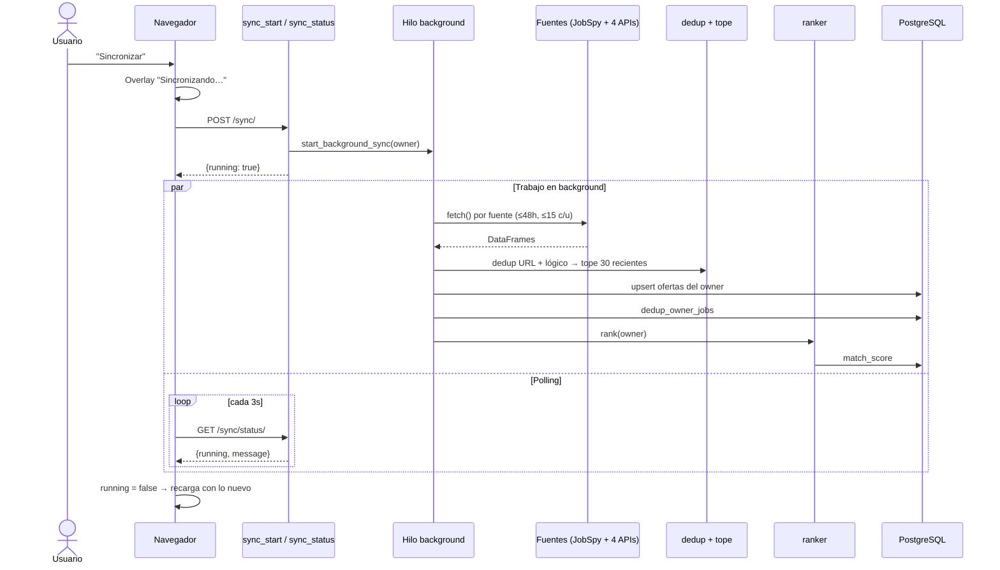

**Pipeline interno de la sincronización:**

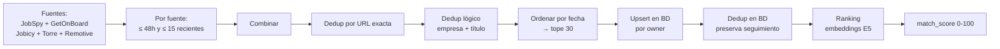

### 7. Ver ofertas y detalle (filtros preservados)

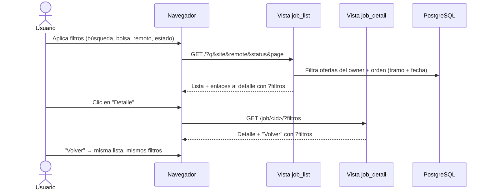

### 8. Seguimiento: estado, favorito y notas

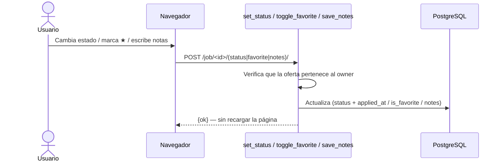

### 9. Ver perfil

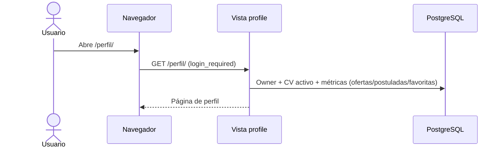

---

## Estructura del proyecto

```
find-job-please/
├── docker-compose.yml          db (Postgres) + web (Django)
├── com.andres.findjob.plist    sync programado (launchd)
└── web/
    ├── config/                 settings · urls · wsgi
    └── jobs/
        ├── models.py           User↔Owner · CV · Job
        ├── views.py            auth, lista, detalle, sync, cv, acciones, perfil
        ├── forms.py            registro
        ├── sync.py             orquesta fuentes → dedup → rank (hilo background)
        ├── services/
        │   ├── config.py       filtros (48h, 15/plataforma, tope 30)
        │   ├── scraper.py      JobSpy (LinkedIn/Indeed)
        │   ├── importer.py     DataFrame → upsert
        │   ├── dedup.py        duplicados lógicos
        │   ├── cv.py           PDF → texto + keywords
        │   ├── rankers/        keyword · embeddings (E5)
        │   └── connectors/     getonbrd · jobicy · torre · remotive
        └── templates/          job_list · job_detail · profile · registration/*
```
